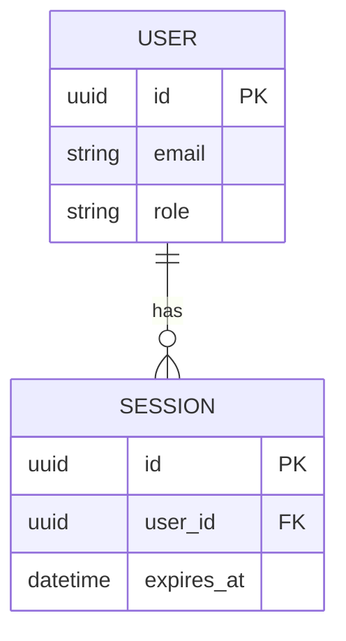

# Data Model — Current Truth

> File này mô tả TRẠNG THÁI HIỆN TẠI đã chốt của data model (entity, quan hệ,
> ràng buộc dữ liệu). Chỉ cập nhật khi có `changes/<ticket-id>/delta-spec.md`
> liên quan đến data model được merge — bao gồm cả lần khởi tạo đầu tiên
> (ticket đầu tiên tạo file này từ rỗng, xem CLAUDE.md mục 4).

## 1. Sơ đồ quan hệ (ERD — mức tổng quan)

<Có thể vẽ bằng mermaid nếu tool render được, hoặc ASCII đơn giản>

## 2. Danh sách entity chính

| Entity   | Mô tả                          | Spec hành vi liên quan   |
|----------|----------------------------------|----------------------------|
| User     | Người dùng hệ thống              | `specs/auth.md`            |
| Session  | Phiên đăng nhập                  | `specs/auth.md`            |
| ...      | ...                                | ...                          |

## 3. Ràng buộc dữ liệu quan trọng (EARS-style)

- **[DM-01]** The `User.email` field shall be unique across the system.
- **[DM-02]** When a `User` is deleted, the system shall cascade-delete all
  associated `Session` records.
- **[DM-03]** The system shall not allow `Session.expires_at` to be set in
  the past at creation time.

## 4. Ràng buộc tuân thủ (nếu áp dụng — vd APPI/dữ liệu khách hàng Nhật)

- <vd: The system shall store all PII fields encrypted at rest.>
- <vd: The system shall retain audit logs for at least N years theo yêu cầu
  hợp đồng với khách hàng.>

## 5. Lịch sử thay đổi data model

| Ngày       | Ticket ID           | Thay đổi                              |
|------------|----------------------|------------------------------------------|
| YYYY-MM-DD | SIC_DEV-1           | Khởi tạo data model ban đầu (User, Session) |
