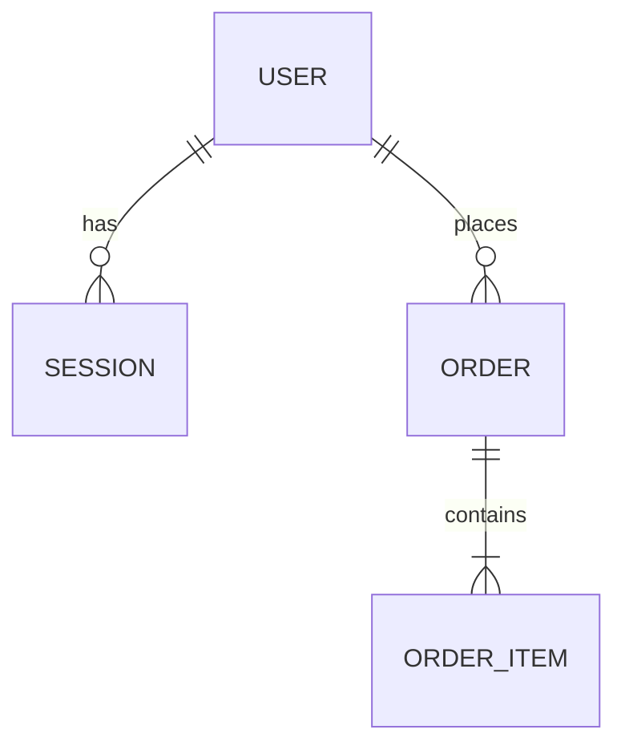

# Data Model — Tổng quan ER toàn hệ thống

> File này CHỈ giữ bức tranh tổng quan (bảng nào tồn tại, quan hệ với
> nhau ra sao) + quy ước chung — đúng nghĩa "nền tảng, ít đổi". KHÔNG chứa
> field/type/constraint chi tiết của từng bảng — phần đó nằm trong
> `specs/<module>.md` (mục `## Data Model`) của module SỞ HỮU entity đó
> (xem CLAUDE.md mục 4, quy tắc "1 entity = 1 module sở hữu").
>
> File này chỉ cập nhật khi có bảng MỚI xuất hiện hoặc bị xoá, hoặc quan
> hệ giữa các bảng thay đổi — KHÔNG cập nhật khi chỉ thêm/sửa field.

## 1. Sơ đồ ER tổng quan (chỉ tên bảng + quan hệ, không có field)

## 2. Bảng entity → module sở hữu

> Mỗi entity chỉ có ĐÚNG 1 module sở hữu (nơi field-level schema được
> định nghĩa). Module khác nếu chỉ tham chiếu (FK) tới entity này thì
> KHÔNG lặp lại field, chỉ ghi "tham chiếu `<Entity>.id`, xem spec module
> sở hữu".

| Entity     | Module sở hữu | Spec chi tiết (field-level)      |
|------------|----------------|-------------------------------------|
| User       | auth           | `specs/example-module-auth.md`     |
| Session    | auth           | `specs/example-module-auth.md`     |
| Order      | orders         | `specs/orders.md`                   |
| OrderItem  | orders         | `specs/orders.md`                   |

## 3. Quy ước chung toàn hệ thống (áp dụng mọi bảng)

- **[DM-G01]** The system shall use UUID (v4) as primary key type for
  every table.
- **[DM-G02]** Every table shall include `created_at` and `updated_at`
  (timestamp, auto-managed).
- **[DM-G03]** Soft-delete tables (nếu có) shall use `deleted_at`
  (nullable timestamp) thay vì xoá cứng bản ghi.
- **[DM-G04]** Foreign key column naming convention: `<referenced_table>_id`
  (vd: `user_id`, không dùng `userId`/`fk_user`).

## 4. Ràng buộc tuân thủ chung (nếu áp dụng — vd APPI)

- <vd: The system shall store all PII fields encrypted at rest.>
- <vd: The system shall retain audit logs for at least N năm theo yêu cầu
  hợp đồng với khách hàng.>

## 5. Lịch sử thay đổi (chỉ log khi THÊM/XOÁ bảng hoặc đổi quan hệ)

| Ngày       | Ticket ID | Thay đổi                                  |
|------------|-----------|-----------------------------------------------|
| YYYY-MM-DD | TICKET-1 | Khởi tạo: thêm User, Session                  |
| YYYY-MM-DD | TICKET-8 | Thêm Order, OrderItem (module orders mới)     |

<!-- Thêm field vào User/Order... KHÔNG log ở đây — xem lịch sử trong
     specs/<module>.md tương ứng. -->
